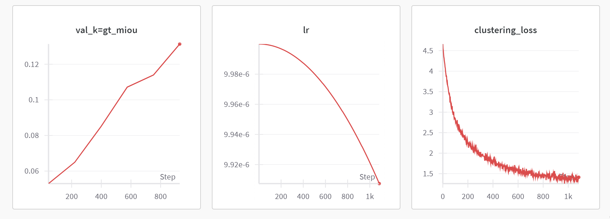

# TimeT_clean
This is a better implementation of TimeT model. 

## Running the Code

1. Main training script:
   ```
   python exp_time_tuning_v2.py
   ```

   You can customize the run with command-line arguments:
   ```
   python exp_time_tuning_v2.py --device cuda:0 --batch_size 32 --num_epochs 100
   ```

2. For evaluation:
   ```
   python evaluation.py
   ```

3. To test the feature forwarder:
   ```
   python test_feature_forwarder.py
   ```


## Logging and Visualization

The code uses Weights & Biases (wandb) for logging and visualization. Ensure you're logged in to your wandb account.


## Performance curves

You should see something like this:



